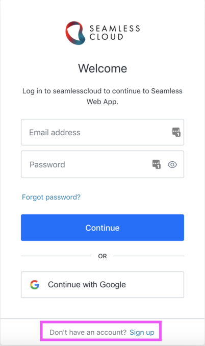

# Monitor country's COVID situation and decide when it's safe to travel

This job sends daily Whatsapp messages with COVID confirmed cases data and gives traveling recommendation. The data source is [https://covid19api.com/](https://covid19api.com/)  

- [Requirements](#requirements)
- [Setting up Twilio](#setting-up-twilio)
- [Setting up SeamlessCloud](#setting-up-seamlesscloud)
- [Running the script]()

## Requirements
1. Python 3.6 or higher
2. WhatsApp free account
3. Twilio free account
4. [SeamlessCloud](http://seamlesscloud.io/) free account

## Setting up Twilio
We are going to use Twilio account to send messages to Whatsapp. 

1. Navigate to [https://www.twilio.com/](https://www.twilio.com/), Sign up, verify your email and phone number.
    

2. Choose yes on the "Do you write code?" screen.   
    
    
3. Choose Python on the "What is your preferred language?" screen.   
    
    
4. Choose "Use Twilio in a project" on the "What is your goal today?" screen.   
    
    
5. Choose "Send WhatsApp messages" on the "What do you want to do first?" screen.   
    
    
6. Twillio asks you if you want to activate the Sandbox. Agree and click "Confirm".   
    
    
6. Now Twillio wants you to connect your WhatsApp account. Please follow instructions.
    

## Setting up SeamlessCloud  
Create a free account in [http://seamlesscloud.io](http://seamlesscloud.io/).  

## Running the script  
Follow [Quick Start Guide](https://app.seamlesscloud.io/guide) to run and publish your first test job. When you will be done with testing, copy/paste files from this folder to yours.    

We are almost there! Run our script on the SeamlessCloud: `smls run`. If you set up everything correctly, you will receive an email `World Indices Daily Report`. And finally, let's deploy our script to execute it on schedule, say 9 AM every day (UTC time): `smls publish --name "World Indices Daily Report" --schedule "0 9 * * *"`. If you are new to cron schedule, check this service [https://crontab.guru](https://crontab.guru/). 
    

