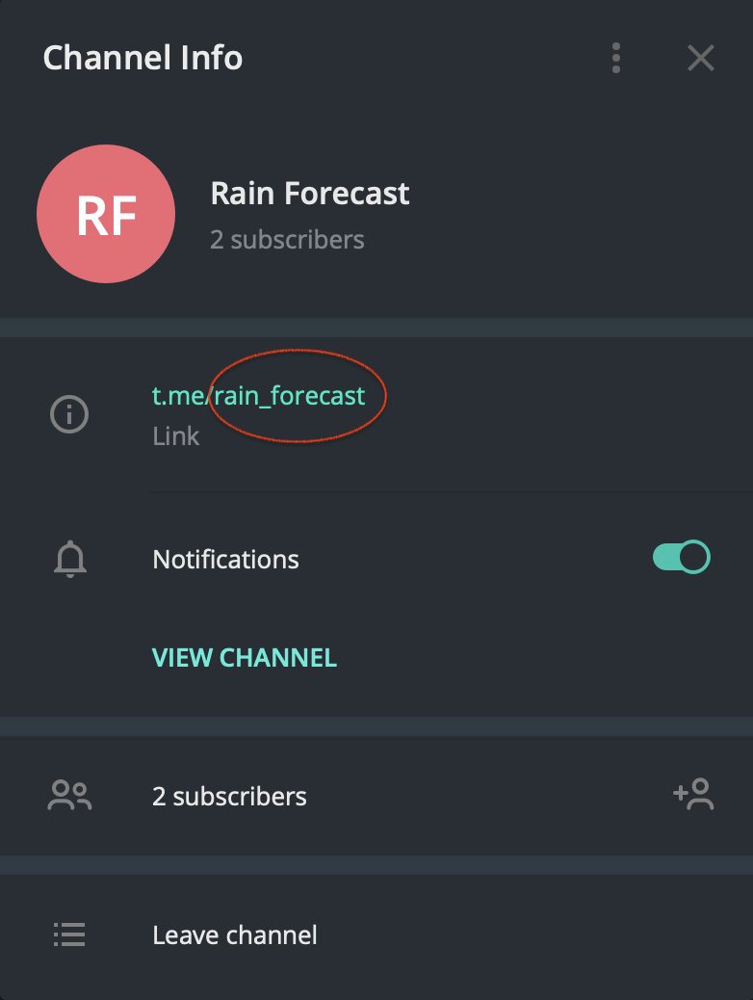
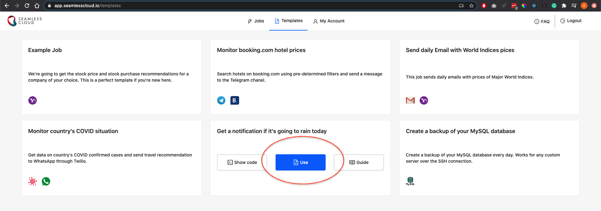
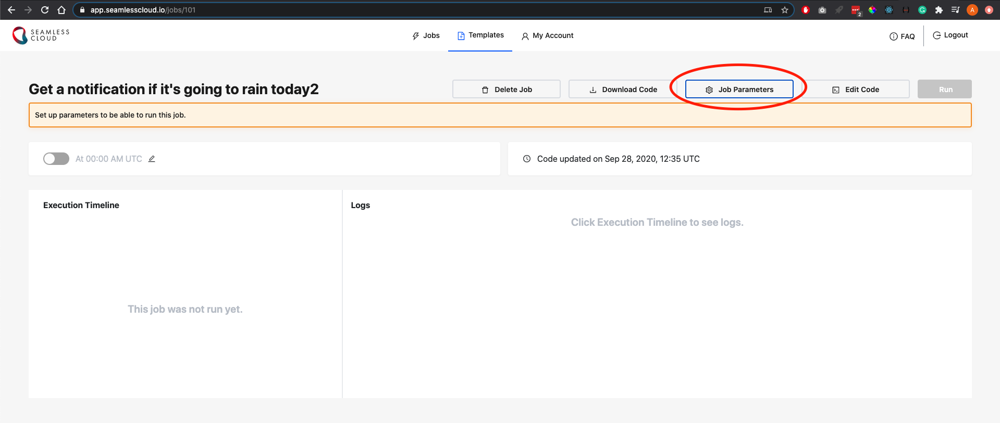

This script sends a message to telegram if in the specified location there is a rain in the weather forecast for current day.
The code could also be found here https://app.seamlesscloud.io/templates.

## Getting the weather forecast

We're going to use https://openweathermap.org/ to get the weather forecast using Python. It is free to use. The only thing you need to do is to create an account to get your API key. Please sign up here. After you've signed up, you can find your API key on this page. Save it somewhere. We're going to use it later.
It takes time for the API key to be activated. I waited for around 30 minutes. If the Python script returns an error that looks like " Invalid API key. Please see http://openweathermap.org/faq#error401 for more info. " you need to wait a bit before it gets activated.

## Set up a messenger to receive notifications

We're going to use Telegram to receive notifications. You would need to create a bot that will send messages. Please follow the documentation and create the bot. You need to create a channel, make it public, and invite the bot into the channel.

This is an example of a channel that I've created. In this case, the channel name is rain_forecast. Note that the text at the top ("Rain Forecast") is just for display purposes. To address our channel from Python, we need to use @rain_forecast as a channel name.

## Script Parameters

At the top of the file, we have declared five variables. The first one is WEATHER_API_KEY - this is the key from your Open Weather account. LATITUDE and LONGITUDE are coordinates for the location where you live (to get them, just google "<your city name> coordinates"). BOT_API_KEY is the key you've got during the Telegram bot set up. CHANNEL_NAME is the name of the public channel you've created with @ at the beginning. In my case, it's @rain_forecast. You would need to enter the name of your channel that you've created.

## How the script works

The first request in the script is the call to Open Weather API. Then we get the description of the weather forecast for the current day. It will contain the word rain if it's expected to rain. If we find the word rain - we make a request to the Telegram API asking to send a message from our bot. That's it!

## Scheduling the script to run daily

You can sign up here -> https://www.seamlesscloud.io/. In fact, on our platform, you don't even have to write any Python code to use the script from this article. Just go to the Templates tab and find a template that's called "Get a notification if it's going to rain today." Hover over it and click "Use."

The last thing is to fill out the Parameters - values I've described in the Script Parameters section.

After you fill in all the Parameters, click Run, and make sure everything works. You can also set up a schedule for this code to run. For example, I've set up the script to be executed every day at 7.00 AM.

This is how the notification looks like:

Congratulations! You've learned how to get a weather forecast using Python and make it actionable. As a next step, you can make the script more complicated by analyzing more weather data. You can find documentation about Open Weather API here. There are many things you can do. The sky is the limit.
You can also read this Readme as an article in our blog -> https://blog.seamlesscloud.io/2020/09/be-prepared-for-bad-weather-using-20-lines-of-python/
