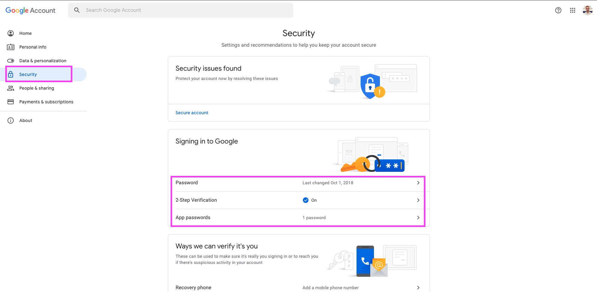
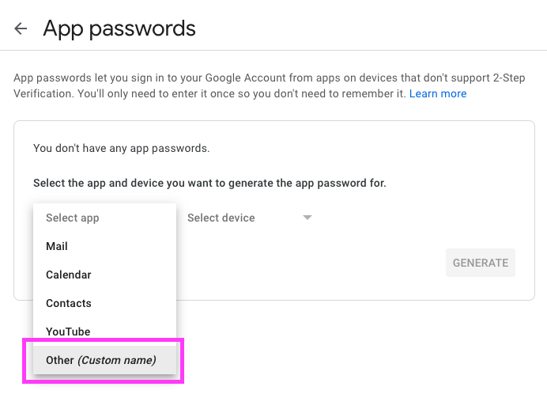
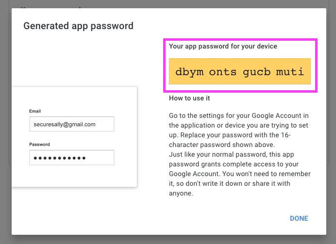
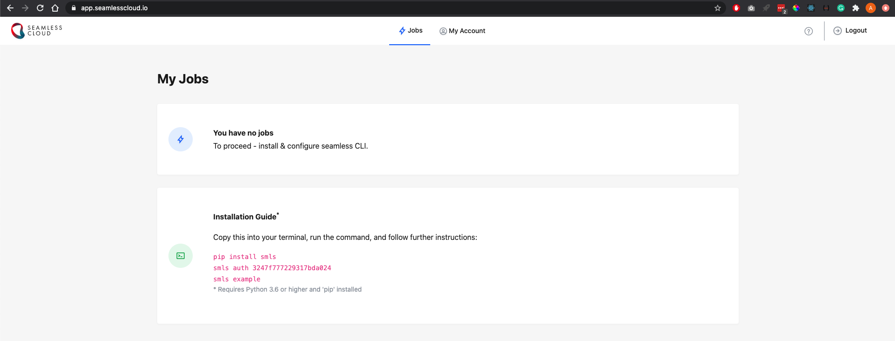

# Send daily email with Major World Indices prices

This job sends daily emails with prices of Major World Indices. The data source is [https://finance.yahoo.com/world-indices](https://finance.yahoo.com/world-indices)  

- [Requirements](#requirements)
- [Setting up Gmail](#setting-up-gmail)
- [Setting up SeamlessCloud](#setting-up-seamlesscloud)
- [Running the script]()

## Requirements
1. Python 3.6 or higher
2. Gmail account
3. [SeamlessCloud](http://seamlesscloud.io/) account

## Setting up Gmail
We are going to use Gmail account to send emails. For security reasons, user's Gmail password cannot be used in Python script. Also, we are not going to turn on the [Less Secure App Access](https://support.google.com/accounts/answer/6010255?hl=en) instead, we will enable 2-Step Verification and create an app password.

1. Navigate to [https://myaccount.google.com/](https://myaccount.google.com/) and open the `Security` tab. Then, enable `2-Step Verification` and click `App passwords`.  
    

2. In the dropdown menu, select `Other (Custom name)` option and name your application, for example `World Indices`.   
    
    
3. Paste somewhere the generated password (to be 100% clear, you will have a different password from the one you see on the screenshot). We are going to use this password in our Python script.  
    

## Setting up SeamlessCloud  
Create a free account at [http://seamlesscloud.io](http://seamlesscloud.io/). Since you already have a Gmail account you will be able to sign up and then log in with your Gmail account.  

## Running the script  
Follow instructions to run and publish your first test job. 

You can also check out the [Quick Start Guide](https://app.seamlesscloud.io/guide). When you will be done with testing, copy/paste files from this folder to yours. Additionally, create `.env` file where we are going to store our Gmail credentials (check `.example_env` file for the reference). Since we are going to send an email to yourself, `SENDER` and `RECIPIENT` should be the same unless you want to send an email to other recipients. `PASSWORD` is a password from the [Setting up Gmail](#setting-up-gmail) step.  

The next step is to install requirements: `pip install -r requirements`. Please, remember, SeamlessCloud requires Python>=3.6, so you may need to use `pip3`.  

We are almost there! Run our script on the SeamlessCloud: `smls run`. If you set up everything correctly, you will receive an email `World Indices Daily Report`. And finally, let's deploy our script to execute it on schedule, say 9 AM every day (UTC): `smls publish --name "World Indices Daily Report" --schedule "0 9 * * *"`. If you are new to cron schedule, check this service [https://crontab.guru](https://crontab.guru/). 
    

